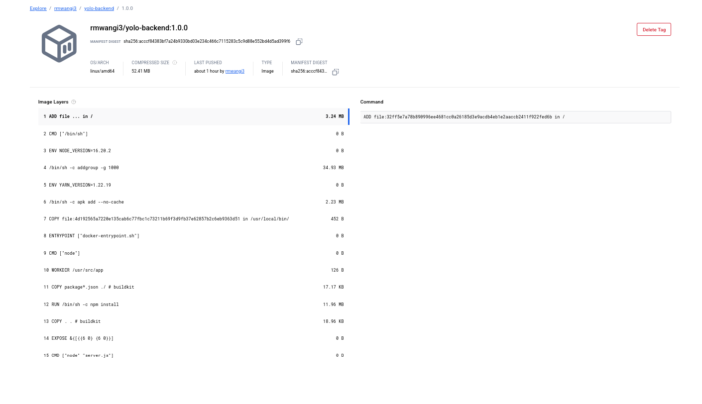
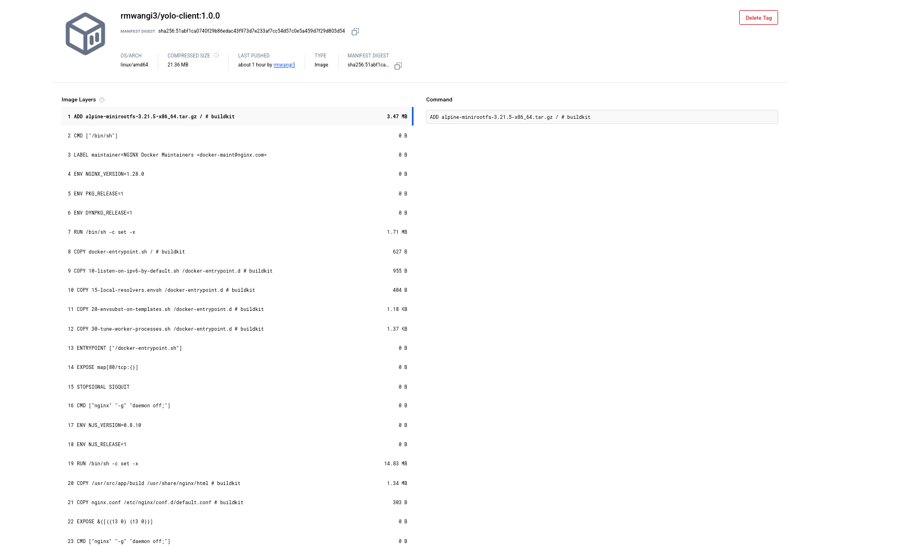

# Docker Implementation: Explanations & Practices

## 1. Base images
- Backend: `node:16-alpine` — small, secure base for Express and native modules.
- Client: multi-stage build — `node:16-alpine` (build) → `nginx:stable-alpine` (runtime). This produces optimized static assets served by a lightweight web server.
- Database: `mongo:5.0` — official MongoDB image for stability and compatibility.

Notes: Prefer pinning exact patch versions (e.g., `node:16.20.0-alpine`) for reproducible builds.

## 2. Dockerfile patterns
- Use `FROM` to select the base image.
- Use `WORKDIR` to set the working directory.
- Copy package manifests first and install dependencies (leverages Docker layer caching):
  - `COPY package*.json ./`
  - `RUN npm ci --only=production` (or `npm ci` in the build stage)
- Copy source: `COPY . .`
- Build step (client): `RUN npm run build` to produce production assets.
- Use multi-stage builds for client to produce a small runtime image.
- Use `EXPOSE` to document container ports (e.g., `5000` for backend, `80` for client). Publishing to the host is done via docker-compose or `docker run -p`.
- Prefer `CMD` or `ENTRYPOINT` as appropriate:
  - Backend: `CMD ["node", "server.js"]`
  - Client (nginx): `CMD ["nginx", "-g", "daemon off;"]`

## 3. Docker Compose: networking & ports
- Use a custom bridge network (e.g., `yolo-network`) so services can resolve each other by name (e.g., `mongo`).
- Example port mappings:
  - backend: `5000:5000`
  - client: `3000:80` (React/static app available at `http://localhost:3000`)

## 4. Data persistence
- Use a named volume for MongoDB:
  - `volumes: - mongo-data:/data/db`
- This ensures data persists across container restarts.

## 5. Git workflow
- Branching: create feature branches from `master` (e.g., `feature/dockerize`).
- Commit style: small, focused commits (e.g., `add backend Dockerfile`).
- Open pull requests for review before merging to `master`.

## 6. Running & debugging
- Build and run: `docker-compose up --build`
- Backend DB connection: set `MONGODB_URI=mongodb://mongo:27017/yolomy` so the backend resolves the DB service via Compose DNS.
- Logs:
  - `docker-compose logs -f backend`
  - `docker-compose logs -f mongo`
- Node version issues: check `engines` in `client/package.json` and adjust base image accordingly.

## 7. Image tagging & release practices
- Always use explicit tags (avoid `latest`), e.g., `rmwangi3/yolo-backend:1.0.0`.
- For CI/CD, use semantic versioning and include build metadata (or image digests) for traceability.

## 8. Security & reliability recommendations (additional)
- Run containers as a non-root user when possible.
- Add `HEALTHCHECK` for critical services (backend, database) and use container restart policies.
- Don’t store secrets in images; use environment variables, Docker secrets, or a secrets manager.
- Add resource limits in Compose (cpu/memory) for production deployments.

## 9. Development convenience
- Add a `.dockerignore` to exclude node_modules, logs, .git, and other unnecessary files.
- Consider `docker-compose.override.yml` for development-specific overrides (volumes, hot-reload).

## 10. DockerHub verification
- After pushing images, include screenshots on the repository or docs showing the repositories and tags, e.g.:
  - 
  - 